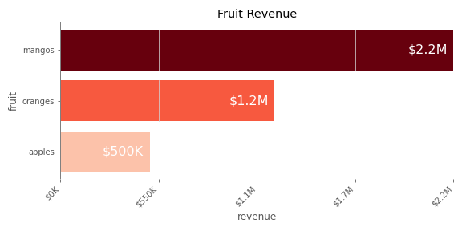
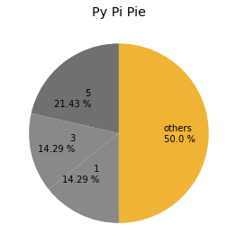

# Ideal Forms
## "Some charts I prepared earlier."
Matplotlib charts formatted according to [The Data Visualization Catalogue](https://datavizcatalogue.com/).

## Install
```pip install idealforms```

## Bar
```python
from idealforms.bar import bar
from idealforms.formatters import money_formatter

categorical_data = dict(apples=500000,
                        oranges=1200000,
                        mangos=2200005)

fig, ax = bar(categorical_data,
              x_label='revenue',
              y_label='fruit',
              title='Fruit Revenue',
              formatter=money_formatter)
```



## Pie
```python
import matplotlib.pyplot as plt
from idealforms.pie import pie
from collections import Counter
my_pi = "3.1415926535897"
pi_digits_count = Counter(str(my_pi).replace('.',''))

fig, ax = pie(
    pi_digits_count, 
    title='Py Pi Pie', 
    reverse_color_order=True,
    largest_color='xkcd:macaroni and cheese',
    figsize=(4,4)
)
plt.show()
```

