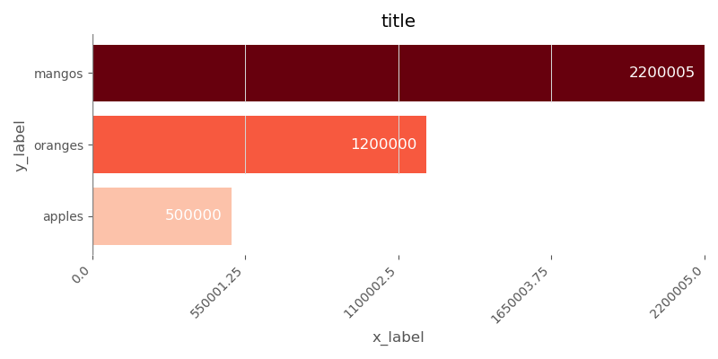

# Ideal Forms
## "Some charts I prepared earlier."
Matplotlib charts formatted according to [The Data Visualization Catalogue](https://datavizcatalogue.com/).

## Install
1. ```git checkout https://github.com/ilmcconnell/idealforms.git```
2. ```cd idealforms```
3. ```pip install -e .```

## Bar
```python
import matplotlib.pyplot as plt
from idealforms.bar import bar

category_data = dict(apples=500000,
                     oranges=1200000,
                     mangos=2200005)

fig, ax = bar(category_data,
              title='title',
              y_label='y_label',
              x_label='x_label')
plt.show()
```
